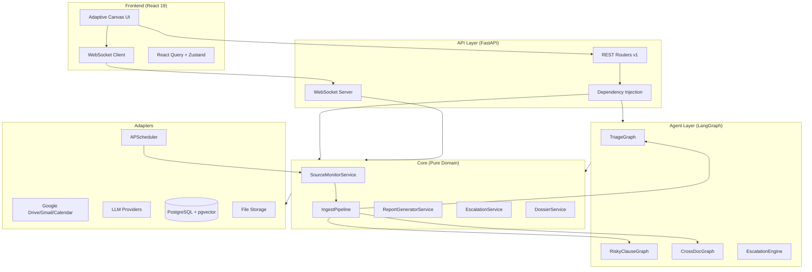
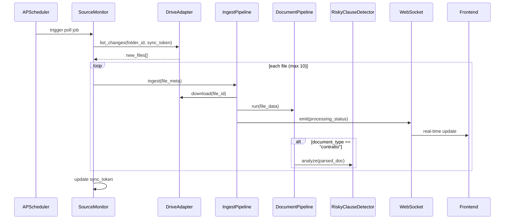
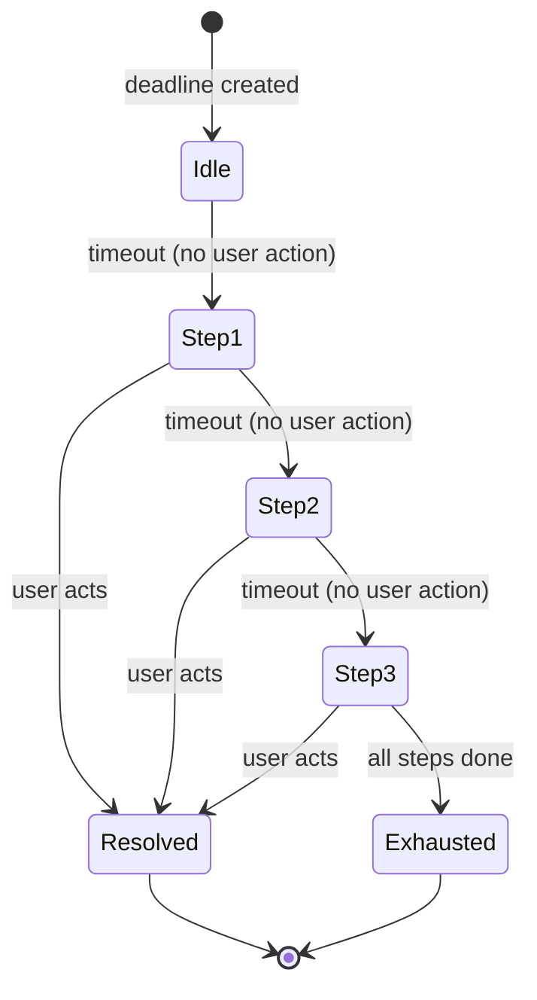

# Design Document: ACG Agent Enhancement

## Overview

This design covers the evolution of ACG from a reactive assistant to a proactive, agent-centric system across 8 axes: passive ingestion, risky clause detection, cross-document intelligence, notification escalation, exportable reports, G Suite quick views, navigation redesign, and cross-cutting UX consistency.

The system extends the existing hexagonal architecture (ports & adapters) with new domain services, LangGraph nodes, and a real-time WebSocket layer. All new components follow the established dependency rules: pure logic in `core/`, LLM orchestration in `agent/`, external integrations in `adapters/`, and wiring in `api/`.

### Key Design Decisions

1. **Source Monitor as APScheduler jobs** — Polling is managed by APScheduler (already in stack), with per-source job scheduling. This avoids introducing a message broker for MVP while supporting configurable intervals.

2. **LangGraph for AI analysis pipelines** — Risky clause detection and cross-document correlation use dedicated LangGraph graphs with structured output, enabling retry, fallback, and observability.

3. **WebSocket + SSE fallback for real-time** — A single WebSocket connection per client multiplexes all event types. Server-Sent Events (SSE) serves as fallback for environments where WebSocket is unavailable.

4. **Escalation as state machine** — Each escalation sequence is modeled as a finite state machine persisted in PostgreSQL, with APScheduler triggering transitions.

5. **Report generation via templates** — Reports use Jinja2 templates rendered to HTML, then converted to PDF (WeasyPrint) or Excel (openpyxl). No external report service needed.

6. **Frontend state via Zustand + React Query** — Real-time updates flow through WebSocket into Zustand stores, with React Query handling REST data fetching and cache invalidation.

---

## Architecture

### High-Level Component Diagram



### Data Flow: Passive Ingestion



### Data Flow: Escalation



---

## Components and Interfaces

### New Ports (Protocols)

```python
# core/ports/source_monitor.py
@runtime_checkable
class SourceMonitorPort(Protocol):
    """Port for polling external sources for new content."""
    async def list_changes(
        self, source_config: SourceConfig, sync_token: str | None
    ) -> ChangeSet: ...

    async def download_file(self, source_type: str, file_ref: str) -> bytes: ...


# core/ports/report.py
@runtime_checkable
class ReportRendererPort(Protocol):
    """Port for rendering reports to different formats."""
    async def render_pdf(self, template: str, data: ReportData) -> bytes: ...
    async def render_excel(self, template: str, data: ReportData) -> bytes: ...


# core/ports/realtime.py
@runtime_checkable
class RealtimePort(Protocol):
    """Port for emitting real-time events to connected clients."""
    async def emit(self, user_id: str, event: RealtimeEvent) -> None: ...
    async def broadcast(self, event: RealtimeEvent) -> None: ...


# core/ports/escalation.py
@runtime_checkable
class EscalationSchedulerPort(Protocol):
    """Port for scheduling escalation step transitions."""
    async def schedule_step(
        self, escalation_id: str, delay_seconds: int
    ) -> str: ...  # returns job_id
    async def cancel_step(self, job_id: str) -> None: ...
```

### New Core Services

| Service | Responsibility |
|---------|---------------|
| `SourceMonitorService` | Manages source configurations, triggers polling, handles sync tokens |
| `IngestPipelineService` | Orchestrates download → DocumentPipeline → status emission |
| `RiskyClauseService` | Coordinates clause detection, stores results, manages confidence |
| `CrossDocumentService` | Finds correlations, manages dossiers, detects conflicts |
| `EscalationService` | Manages escalation rules, state machine transitions, HITL creation |
| `ReportGeneratorService` | Builds report data, applies templates, manages export history |
| `DossierService` | Groups correlated documents, tracks completeness |
| `ConfirmationFlowService` | Unified HITL confirmation creation and resolution |

### New LangGraph Graphs

| Graph | Purpose | Risk Score |
|-------|---------|-----------|
| `RiskyClauseGraph` | Analyzes contracts for risky clauses with source attribution | 0 (read-only) |
| `CrossDocGraph` | Correlates documents, detects conflicts | 1 (internal write) |
| `CalendarRelevanceGraph` | Classifies calendar events for administrative relevance | 0 (read-only) |
| `EscalationDraftGraph` | Generates escalation email/event drafts | 0 (draft only) |

### New Adapters

| Adapter | Port | SDK |
|---------|------|-----|
| `GoogleDriveMonitorAdapter` | `SourceMonitorPort` | google-api-python-client |
| `GmailMonitorAdapter` | `SourceMonitorPort` | google-api-python-client |
| `CalendarMonitorAdapter` | `SourceMonitorPort` | google-api-python-client |
| `WeasyPrintReportAdapter` | `ReportRendererPort` | WeasyPrint |
| `OpenpyxlReportAdapter` | `ReportRendererPort` | openpyxl |
| `WebSocketRealtimeAdapter` | `RealtimePort` | FastAPI WebSocket |
| `APSchedulerEscalationAdapter` | `EscalationSchedulerPort` | APScheduler |

### API Endpoints (New)

| Endpoint | Method | Purpose |
|----------|--------|---------|
| `/api/v1/sources` | CRUD | Source monitor configuration |
| `/api/v1/sources/{id}/status` | GET | Live source status |
| `/api/v1/clauses/{document_id}` | GET | Risky clauses for a document |
| `/api/v1/correlations/{document_id}` | GET | Cross-document correlations |
| `/api/v1/dossiers` | GET/POST | Dossier management |
| `/api/v1/dossiers/{id}` | GET | Dossier detail with completeness |
| `/api/v1/escalation-rules` | CRUD | Escalation rule configuration |
| `/api/v1/escalation-status/{deadline_id}` | GET | Current escalation state |
| `/api/v1/reports` | POST | Generate report |
| `/api/v1/reports/{id}/export` | POST | Export to Drive/Gmail |
| `/api/v1/reports/templates` | GET | Available report templates |
| `/api/v1/reports/history` | GET | Report generation history |
| `/ws/processing-feed` | WS | Real-time processing events |
| `/ws/events` | WS | General real-time event stream |

---

## Data Models

### New Database Tables

```sql
-- Source monitor configuration
CREATE TABLE monitored_sources (
    id UUID PRIMARY KEY DEFAULT gen_random_uuid(),
    user_id UUID NOT NULL REFERENCES users(id),
    source_type VARCHAR(20) NOT NULL CHECK (source_type IN ('drive', 'gmail', 'calendar')),
    config JSONB NOT NULL,  -- folder_id/label_ids/calendar_id, polling_interval, etc.
    status VARCHAR(20) NOT NULL DEFAULT 'active',  -- active, error, paused
    last_sync_token TEXT,
    last_sync_at TIMESTAMPTZ,
    last_sync_count INT DEFAULT 0,
    error_count INT DEFAULT 0,
    created_at TIMESTAMPTZ NOT NULL DEFAULT now(),
    updated_at TIMESTAMPTZ NOT NULL DEFAULT now()
);

-- Risky clause detection results
CREATE TABLE risky_clauses (
    id UUID PRIMARY KEY DEFAULT gen_random_uuid(),
    document_id UUID NOT NULL REFERENCES documents(id) ON DELETE CASCADE,
    category VARCHAR(50) NOT NULL,  -- rinnovo_automatico, penale, limitazione_responsabilita, recesso, esclusiva, non_concorrenza
    severity VARCHAR(10) NOT NULL CHECK (severity IN ('alto', 'medio', 'basso')),
    clause_text TEXT NOT NULL,
    page_number INT,
    paragraph_ref TEXT,
    plain_language_explanation TEXT NOT NULL,  -- max 200 chars
    confidence_score FLOAT NOT NULL,
    created_at TIMESTAMPTZ NOT NULL DEFAULT now()
);

-- Cross-document correlations
CREATE TABLE document_correlations (
    id UUID PRIMARY KEY DEFAULT gen_random_uuid(),
    user_id UUID NOT NULL REFERENCES users(id),
    source_document_id UUID NOT NULL REFERENCES documents(id),
    target_document_id UUID NOT NULL REFERENCES documents(id),
    correlation_type VARCHAR(30) NOT NULL,  -- derivato_da, versione_di, allegato_di, in_conflitto_con
    confidence_score FLOAT NOT NULL,
    source_passage TEXT,  -- text from source doc justifying correlation
    target_passage TEXT,  -- text from target doc justifying correlation
    source_page INT,
    target_page INT,
    created_at TIMESTAMPTZ NOT NULL DEFAULT now(),
    CONSTRAINT different_docs CHECK (source_document_id != target_document_id)
);

-- Dossiers (logical document groups)
CREATE TABLE dossiers (
    id UUID PRIMARY KEY DEFAULT gen_random_uuid(),
    user_id UUID NOT NULL REFERENCES users(id),
    title TEXT NOT NULL,
    dossier_type VARCHAR(50),  -- contratto_quadro, fascicolo_fornitore, etc.
    completeness_status VARCHAR(20) NOT NULL DEFAULT 'incomplete',  -- complete, incomplete
    missing_items JSONB DEFAULT '[]',  -- [{description, certainty: "certain"|"probable"}]
    created_at TIMESTAMPTZ NOT NULL DEFAULT now(),
    updated_at TIMESTAMPTZ NOT NULL DEFAULT now()
);

CREATE TABLE dossier_documents (
    dossier_id UUID NOT NULL REFERENCES dossiers(id) ON DELETE CASCADE,
    document_id UUID NOT NULL REFERENCES documents(id),
    role TEXT,  -- contratto_principale, fattura, allegato, etc.
    added_at TIMESTAMPTZ NOT NULL DEFAULT now(),
    PRIMARY KEY (dossier_id, document_id)
);

-- Escalation rules
CREATE TABLE escalation_rules (
    id UUID PRIMARY KEY DEFAULT gen_random_uuid(),
    user_id UUID NOT NULL REFERENCES users(id),
    name TEXT NOT NULL,
    deadline_type VARCHAR(30) NOT NULL,  -- fiscale, contrattuale, pagamento, generico
    steps JSONB NOT NULL,  -- [{delay_seconds, channel, recipient, message_template}]
    is_active BOOLEAN NOT NULL DEFAULT true,
    created_at TIMESTAMPTZ NOT NULL DEFAULT now(),
    updated_at TIMESTAMPTZ NOT NULL DEFAULT now()
);

-- Escalation execution state
CREATE TABLE escalation_executions (
    id UUID PRIMARY KEY DEFAULT gen_random_uuid(),
    deadline_id UUID NOT NULL REFERENCES deadlines(id),
    rule_id UUID NOT NULL REFERENCES escalation_rules(id),
    current_step INT NOT NULL DEFAULT 0,
    status VARCHAR(20) NOT NULL DEFAULT 'active',  -- active, resolved, exhausted, cancelled
    next_step_job_id TEXT,  -- APScheduler job reference
    history JSONB DEFAULT '[]',  -- [{step, timestamp, channel, result}]
    started_at TIMESTAMPTZ NOT NULL DEFAULT now(),
    resolved_at TIMESTAMPTZ,
    resolved_by TEXT  -- 'user_action' | 'manual_cancel'
);

-- Report generation history
CREATE TABLE reports (
    id UUID PRIMARY KEY DEFAULT gen_random_uuid(),
    user_id UUID NOT NULL REFERENCES users(id),
    template_name TEXT NOT NULL,
    parameters JSONB NOT NULL,  -- {date_from, date_to, filters, format}
    format VARCHAR(10) NOT NULL CHECK (format IN ('pdf', 'excel')),
    storage_key TEXT,  -- reference to generated file in storage
    export_destination JSONB,  -- {type: "drive"|"email", path/recipient, timestamp}
    created_at TIMESTAMPTZ NOT NULL DEFAULT now()
);
```

### New Pydantic Domain Models

```python
# core/domain/source.py
class SourceConfig(BaseModel):
    id: UUID
    user_id: UUID
    source_type: Literal["drive", "gmail", "calendar"]
    config: DriveSourceConfig | GmailSourceConfig | CalendarSourceConfig
    status: Literal["active", "error", "paused"] = "active"
    last_sync_at: datetime | None = None
    last_sync_count: int = 0

class DriveSourceConfig(BaseModel):
    folder_id: str
    folder_name: str
    polling_interval_minutes: int = 15  # 5–1440

class GmailSourceConfig(BaseModel):
    label_ids: list[str]
    label_names: list[str]
    polling_interval_minutes: int = 10  # 5–1440

class CalendarSourceConfig(BaseModel):
    calendar_id: str
    calendar_name: str
    lookahead_days: int = 30  # 7–90

class ChangeSet(BaseModel):
    new_files: list[FileChange]
    new_sync_token: str | None = None

class FileChange(BaseModel):
    file_id: str
    filename: str
    mime_type: str
    modified_at: datetime


# core/domain/clause.py
class RiskyClause(BaseModel):
    id: UUID
    document_id: UUID
    category: Literal[
        "rinnovo_automatico", "penale", "limitazione_responsabilita",
        "recesso", "esclusiva", "non_concorrenza"
    ]
    severity: Literal["alto", "medio", "basso"]
    clause_text: str
    page_number: int | None = None
    paragraph_ref: str | None = None
    plain_language_explanation: str  # max 200 chars
    confidence_score: float


# core/domain/correlation.py
class DocumentCorrelation(BaseModel):
    id: UUID
    source_document_id: UUID
    target_document_id: UUID
    correlation_type: Literal["derivato_da", "versione_di", "allegato_di", "in_conflitto_con"]
    confidence_score: float
    source_passage: str | None = None
    target_passage: str | None = None
    source_page: int | None = None
    target_page: int | None = None

class Dossier(BaseModel):
    id: UUID
    user_id: UUID
    title: str
    dossier_type: str | None = None
    completeness_status: Literal["complete", "incomplete"] = "incomplete"
    missing_items: list[MissingItem] = []
    documents: list[DossierDocument] = []

class MissingItem(BaseModel):
    description: str
    certainty: Literal["certain", "probable"]

class DossierDocument(BaseModel):
    document_id: UUID
    role: str | None = None


# core/domain/escalation.py
class EscalationRule(BaseModel):
    id: UUID
    user_id: UUID
    name: str
    deadline_type: Literal["fiscale", "contrattuale", "pagamento", "generico"]
    steps: list[EscalationStep]
    is_active: bool = True

class EscalationStep(BaseModel):
    delay_seconds: int  # time to wait before this step fires
    channel: Literal["in_app", "email", "calendar"]
    recipient: str  # user_id, email address, or calendar_id
    message_template: str

class EscalationExecution(BaseModel):
    id: UUID
    deadline_id: UUID
    rule_id: UUID
    current_step: int = 0
    status: Literal["active", "resolved", "exhausted", "cancelled"] = "active"
    history: list[EscalationHistoryEntry] = []

class EscalationHistoryEntry(BaseModel):
    step: int
    timestamp: datetime
    channel: str
    result: Literal["sent", "pending_hitl", "failed", "skipped"]


# core/domain/report.py
class ReportRequest(BaseModel):
    user_id: UUID
    template_name: str
    date_from: date
    date_to: date
    filters: ReportFilters
    format: Literal["pdf", "excel"]

class ReportFilters(BaseModel):
    deadline_types: list[str] | None = None
    statuses: list[str] | None = None
    categories: list[str] | None = None

class ReportData(BaseModel):
    title: str
    period: str
    generated_at: datetime
    rows: list[ReportRow]
    summary: dict = {}

class ReportRow(BaseModel):
    deadline_title: str
    due_date: date
    status: str
    deadline_type: str
    source_document: str | None = None
    source_document_id: UUID | None = None


# core/domain/realtime.py
class RealtimeEvent(BaseModel):
    event_type: str  # processing_status, inbox_item, notification, source_status
    payload: dict
    timestamp: datetime
    user_id: str | None = None  # None for broadcast
```

### Extended Existing Models

The `Document` model gains:
- `source: Literal["upload", "drive", "gmail", "calendar"] = "upload"`
- `source_ref_id: str | None = None` (file_id, message_id, event_id)

The `Deadline` model gains:
- `calendar_event_id: str | None = None` (linked Calendar event)
- `escalation_rule_id: UUID | None = None`

---

