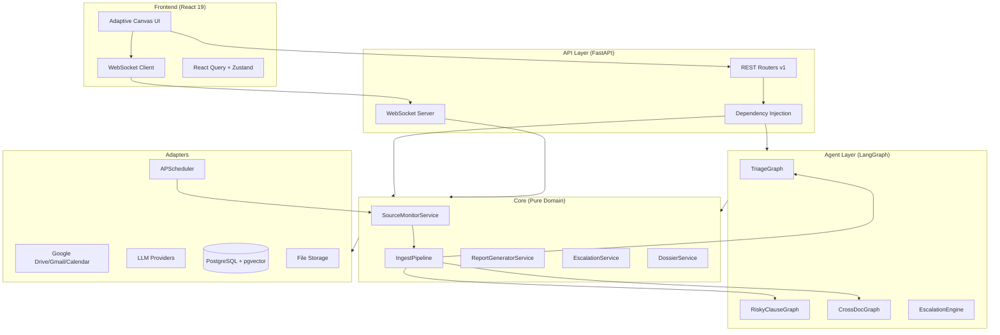
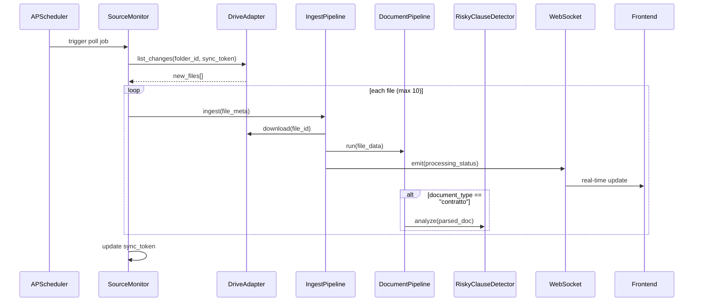
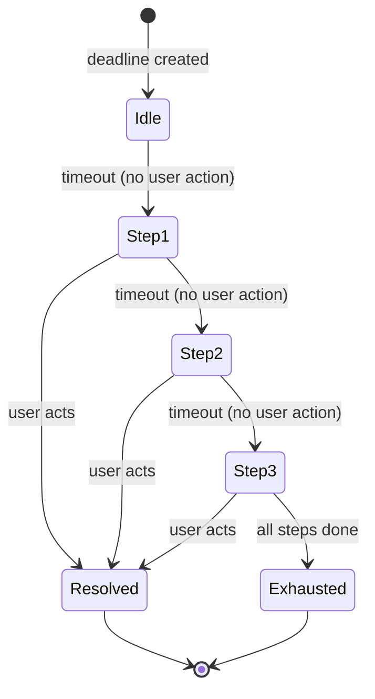

# Design Document: ACG Agent Enhancement

## Overview

This design covers the evolution of ACG from a reactive assistant to a proactive, agent-centric system across 8 axes: passive ingestion, risky clause detection, cross-document intelligence, notification escalation, exportable reports, G Suite quick views, navigation redesign, and cross-cutting UX consistency.

The system extends the existing hexagonal architecture (ports & adapters) with new domain services, LangGraph nodes, and a real-time WebSocket layer. All new components follow the established dependency rules: pure logic in `core/`, LLM orchestration in `agent/`, external integrations in `adapters/`, and wiring in `api/`.

### Key Design Decisions

1. **Source Monitor as APScheduler jobs** — Polling is managed by APScheduler (already in stack), with per-source job scheduling. This avoids introducing a message broker for MVP while supporting configurable intervals.

2. **LangGraph for AI analysis pipelines** — Risky clause detection and cross-document correlation use dedicated LangGraph graphs with structured output, enabling retry, fallback, and observability.

3. **WebSocket + SSE fallback for real-time** — A single WebSocket connection per client multiplexes all event types. Server-Sent Events (SSE) serves as fallback for environments where WebSocket is unavailable.

4. **Escalation as state machine** — Each escalation sequence is modeled as a finite state machine persisted in PostgreSQL, with APScheduler triggering transitions.

5. **Report generation via templates** — Reports use Jinja2 templates rendered to HTML, then converted to PDF (WeasyPrint) or Excel (openpyxl). No external report service needed.

6. **Frontend state via Zustand + React Query** — Real-time updates flow through WebSocket into Zustand stores, with React Query handling REST data fetching and cache invalidation.

---

## Architecture

### High-Level Component Diagram



### Data Flow: Passive Ingestion



### Data Flow: Escalation



---

## Components and Interfaces

### New Ports (Protocols)

```python
# core/ports/source_monitor.py
@runtime_checkable
class SourceMonitorPort(Protocol):
    """Port for polling external sources for new content."""
    async def list_changes(
        self, source_config: SourceConfig, sync_token: str | None
    ) -> ChangeSet: ...

    async def download_file(self, source_type: str, file_ref: str) -> bytes: ...


# core/ports/report.py
@runtime_checkable
class ReportRendererPort(Protocol):
    """Port for rendering reports to different formats."""
    async def render_pdf(self, template: str, data: ReportData) -> bytes: ...
    async def render_excel(self, template: str, data: ReportData) -> bytes: ...


# core/ports/realtime.py
@runtime_checkable
class RealtimePort(Protocol):
    """Port for emitting real-time events to connected clients."""
    async def emit(self, user_id: str, event: RealtimeEvent) -> None: ...
    async def broadcast(self, event: RealtimeEvent) -> None: ...


# core/ports/escalation.py
@runtime_checkable
class EscalationSchedulerPort(Protocol):
    """Port for scheduling escalation step transitions."""
    async def schedule_step(
        self, escalation_id: str, delay_seconds: int
    ) -> str: ...  # returns job_id
    async def cancel_step(self, job_id: str) -> None: ...
```

### New Core Services

| Service | Responsibility |
|---------|---------------|
| `SourceMonitorService` | Manages source configurations, triggers polling, handles sync tokens |
| `IngestPipelineService` | Orchestrates download → DocumentPipeline → status emission |
| `RiskyClauseService` | Coordinates clause detection, stores results, manages confidence |
| `CrossDocumentService` | Finds correlations, manages dossiers, detects conflicts |
| `EscalationService` | Manages escalation rules, state machine transitions, HITL creation |
| `ReportGeneratorService` | Builds report data, applies templates, manages export history |
| `DossierService` | Groups correlated documents, tracks completeness |
| `ConfirmationFlowService` | Unified HITL confirmation creation and resolution |

### New LangGraph Graphs

| Graph | Purpose | Risk Score |
|-------|---------|-----------|
| `RiskyClauseGraph` | Analyzes contracts for risky clauses with source attribution | 0 (read-only) |
| `CrossDocGraph` | Correlates documents, detects conflicts | 1 (internal write) |
| `CalendarRelevanceGraph` | Classifies calendar events for administrative relevance | 0 (read-only) |
| `EscalationDraftGraph` | Generates escalation email/event drafts | 0 (draft only) |

### New Adapters

| Adapter | Port | SDK |
|---------|------|-----|
| `GoogleDriveMonitorAdapter` | `SourceMonitorPort` | google-api-python-client |
| `GmailMonitorAdapter` | `SourceMonitorPort` | google-api-python-client |
| `CalendarMonitorAdapter` | `SourceMonitorPort` | google-api-python-client |
| `WeasyPrintReportAdapter` | `ReportRendererPort` | WeasyPrint |
| `OpenpyxlReportAdapter` | `ReportRendererPort` | openpyxl |
| `WebSocketRealtimeAdapter` | `RealtimePort` | FastAPI WebSocket |
| `APSchedulerEscalationAdapter` | `EscalationSchedulerPort` | APScheduler |

### API Endpoints (New)

| Endpoint | Method | Purpose |
|----------|--------|---------|
| `/api/v1/sources` | CRUD | Source monitor configuration |
| `/api/v1/sources/{id}/status` | GET | Live source status |
| `/api/v1/clauses/{document_id}` | GET | Risky clauses for a document |
| `/api/v1/correlations/{document_id}` | GET | Cross-document correlations |
| `/api/v1/dossiers` | GET/POST | Dossier management |
| `/api/v1/dossiers/{id}` | GET | Dossier detail with completeness |
| `/api/v1/escalation-rules` | CRUD | Escalation rule configuration |
| `/api/v1/escalation-status/{deadline_id}` | GET | Current escalation state |
| `/api/v1/reports` | POST | Generate report |
| `/api/v1/reports/{id}/export` | POST | Export to Drive/Gmail |
| `/api/v1/reports/templates` | GET | Available report templates |
| `/api/v1/reports/history` | GET | Report generation history |
| `/ws/processing-feed` | WS | Real-time processing events |
| `/ws/events` | WS | General real-time event stream |

---

## Data Models

### New Database Tables

```sql
-- Source monitor configuration
CREATE TABLE monitored_sources (
    id UUID PRIMARY KEY DEFAULT gen_random_uuid(),
    user_id UUID NOT NULL REFERENCES users(id),
    source_type VARCHAR(20) NOT NULL CHECK (source_type IN ('drive', 'gmail', 'calendar')),
    config JSONB NOT NULL,  -- folder_id/label_ids/calendar_id, polling_interval, etc.
    status VARCHAR(20) NOT NULL DEFAULT 'active',  -- active, error, paused
    last_sync_token TEXT,
    last_sync_at TIMESTAMPTZ,
    last_sync_count INT DEFAULT 0,
    error_count INT DEFAULT 0,
    created_at TIMESTAMPTZ NOT NULL DEFAULT now(),
    updated_at TIMESTAMPTZ NOT NULL DEFAULT now()
);

-- Risky clause detection results
CREATE TABLE risky_clauses (
    id UUID PRIMARY KEY DEFAULT gen_random_uuid(),
    document_id UUID NOT NULL REFERENCES documents(id) ON DELETE CASCADE,
    category VARCHAR(50) NOT NULL,  -- rinnovo_automatico, penale, limitazione_responsabilita, recesso, esclusiva, non_concorrenza
    severity VARCHAR(10) NOT NULL CHECK (severity IN ('alto', 'medio', 'basso')),
    clause_text TEXT NOT NULL,
    page_number INT,
    paragraph_ref TEXT,
    plain_language_explanation TEXT NOT NULL,  -- max 200 chars
    confidence_score FLOAT NOT NULL,
    created_at TIMESTAMPTZ NOT NULL DEFAULT now()
);

-- Cross-document correlations
CREATE TABLE document_correlations (
    id UUID PRIMARY KEY DEFAULT gen_random_uuid(),
    user_id UUID NOT NULL REFERENCES users(id),
    source_document_id UUID NOT NULL REFERENCES documents(id),
    target_document_id UUID NOT NULL REFERENCES documents(id),
    correlation_type VARCHAR(30) NOT NULL,  -- derivato_da, versione_di, allegato_di, in_conflitto_con
    confidence_score FLOAT NOT NULL,
    source_passage TEXT,  -- text from source doc justifying correlation
    target_passage TEXT,  -- text from target doc justifying correlation
    source_page INT,
    target_page INT,
    created_at TIMESTAMPTZ NOT NULL DEFAULT now(),
    CONSTRAINT different_docs CHECK (source_document_id != target_document_id)
);

-- Dossiers (logical document groups)
CREATE TABLE dossiers (
    id UUID PRIMARY KEY DEFAULT gen_random_uuid(),
    user_id UUID NOT NULL REFERENCES users(id),
    title TEXT NOT NULL,
    dossier_type VARCHAR(50),  -- contratto_quadro, fascicolo_fornitore, etc.
    completeness_status VARCHAR(20) NOT NULL DEFAULT 'incomplete',  -- complete, incomplete
    missing_items JSONB DEFAULT '[]',  -- [{description, certainty: "certain"|"probable"}]
    created_at TIMESTAMPTZ NOT NULL DEFAULT now(),
    updated_at TIMESTAMPTZ NOT NULL DEFAULT now()
);

CREATE TABLE dossier_documents (
    dossier_id UUID NOT NULL REFERENCES dossiers(id) ON DELETE CASCADE,
    document_id UUID NOT NULL REFERENCES documents(id),
    role TEXT,  -- contratto_principale, fattura, allegato, etc.
    added_at TIMESTAMPTZ NOT NULL DEFAULT now(),
    PRIMARY KEY (dossier_id, document_id)
);

-- Escalation rules
CREATE TABLE escalation_rules (
    id UUID PRIMARY KEY DEFAULT gen_random_uuid(),
    user_id UUID NOT NULL REFERENCES users(id),
    name TEXT NOT NULL,
    deadline_type VARCHAR(30) NOT NULL,  -- fiscale, contrattuale, pagamento, generico
    steps JSONB NOT NULL,  -- [{delay_seconds, channel, recipient, message_template}]
    is_active BOOLEAN NOT NULL DEFAULT true,
    created_at TIMESTAMPTZ NOT NULL DEFAULT now(),
    updated_at TIMESTAMPTZ NOT NULL DEFAULT now()
);

-- Escalation execution state
CREATE TABLE escalation_executions (
    id UUID PRIMARY KEY DEFAULT gen_random_uuid(),
    deadline_id UUID NOT NULL REFERENCES deadlines(id),
    rule_id UUID NOT NULL REFERENCES escalation_rules(id),
    current_step INT NOT NULL DEFAULT 0,
    status VARCHAR(20) NOT NULL DEFAULT 'active',  -- active, resolved, exhausted, cancelled
    next_step_job_id TEXT,  -- APScheduler job reference
    history JSONB DEFAULT '[]',  -- [{step, timestamp, channel, result}]
    started_at TIMESTAMPTZ NOT NULL DEFAULT now(),
    resolved_at TIMESTAMPTZ,
    resolved_by TEXT  -- 'user_action' | 'manual_cancel'
);

-- Report generation history
CREATE TABLE reports (
    id UUID PRIMARY KEY DEFAULT gen_random_uuid(),
    user_id UUID NOT NULL REFERENCES users(id),
    template_name TEXT NOT NULL,
    parameters JSONB NOT NULL,  -- {date_from, date_to, filters, format}
    format VARCHAR(10) NOT NULL CHECK (format IN ('pdf', 'excel')),
    storage_key TEXT,  -- reference to generated file in storage
    export_destination JSONB,  -- {type: "drive"|"email", path/recipient, timestamp}
    created_at TIMESTAMPTZ NOT NULL DEFAULT now()
);
```

### New Pydantic Domain Models

```python
# core/domain/source.py
class SourceConfig(BaseModel):
    id: UUID
    user_id: UUID
    source_type: Literal["drive", "gmail", "calendar"]
    config: DriveSourceConfig | GmailSourceConfig | CalendarSourceConfig
    status: Literal["active", "error", "paused"] = "active"
    last_sync_at: datetime | None = None
    last_sync_count: int = 0

class DriveSourceConfig(BaseModel):
    folder_id: str
    folder_name: str
    polling_interval_minutes: int = 15  # 5–1440

class GmailSourceConfig(BaseModel):
    label_ids: list[str]
    label_names: list[str]
    polling_interval_minutes: int = 10  # 5–1440

class CalendarSourceConfig(BaseModel):
    calendar_id: str
    calendar_name: str
    lookahead_days: int = 30  # 7–90

class ChangeSet(BaseModel):
    new_files: list[FileChange]
    new_sync_token: str | None = None

class FileChange(BaseModel):
    file_id: str
    filename: str
    mime_type: str
    modified_at: datetime


# core/domain/clause.py
class RiskyClause(BaseModel):
    id: UUID
    document_id: UUID
    category: Literal[
        "rinnovo_automatico", "penale", "limitazione_responsabilita",
        "recesso", "esclusiva", "non_concorrenza"
    ]
    severity: Literal["alto", "medio", "basso"]
    clause_text: str
    page_number: int | None = None
    paragraph_ref: str | None = None
    plain_language_explanation: str  # max 200 chars
    confidence_score: float


# core/domain/correlation.py
class DocumentCorrelation(BaseModel):
    id: UUID
    source_document_id: UUID
    target_document_id: UUID
    correlation_type: Literal["derivato_da", "versione_di", "allegato_di", "in_conflitto_con"]
    confidence_score: float
    source_passage: str | None = None
    target_passage: str | None = None
    source_page: int | None = None
    target_page: int | None = None

class Dossier(BaseModel):
    id: UUID
    user_id: UUID
    title: str
    dossier_type: str | None = None
    completeness_status: Literal["complete", "incomplete"] = "incomplete"
    missing_items: list[MissingItem] = []
    documents: list[DossierDocument] = []

class MissingItem(BaseModel):
    description: str
    certainty: Literal["certain", "probable"]

class DossierDocument(BaseModel):
    document_id: UUID
    role: str | None = None


# core/domain/escalation.py
class EscalationRule(BaseModel):
    id: UUID
    user_id: UUID
    name: str
    deadline_type: Literal["fiscale", "contrattuale", "pagamento", "generico"]
    steps: list[EscalationStep]
    is_active: bool = True

class EscalationStep(BaseModel):
    delay_seconds: int  # time to wait before this step fires
    channel: Literal["in_app", "email", "calendar"]
    recipient: str  # user_id, email address, or calendar_id
    message_template: str

class EscalationExecution(BaseModel):
    id: UUID
    deadline_id: UUID
    rule_id: UUID
    current_step: int = 0
    status: Literal["active", "resolved", "exhausted", "cancelled"] = "active"
    history: list[EscalationHistoryEntry] = []

class EscalationHistoryEntry(BaseModel):
    step: int
    timestamp: datetime
    channel: str
    result: Literal["sent", "pending_hitl", "failed", "skipped"]


# core/domain/report.py
class ReportRequest(BaseModel):
    user_id: UUID
    template_name: str
    date_from: date
    date_to: date
    filters: ReportFilters
    format: Literal["pdf", "excel"]

class ReportFilters(BaseModel):
    deadline_types: list[str] | None = None
    statuses: list[str] | None = None
    categories: list[str] | None = None

class ReportData(BaseModel):
    title: str
    period: str
    generated_at: datetime
    rows: list[ReportRow]
    summary: dict = {}

class ReportRow(BaseModel):
    deadline_title: str
    due_date: date
    status: str
    deadline_type: str
    source_document: str | None = None
    source_document_id: UUID | None = None


# core/domain/realtime.py
class RealtimeEvent(BaseModel):
    event_type: str  # processing_status, inbox_item, notification, source_status
    payload: dict
    timestamp: datetime
    user_id: str | None = None  # None for broadcast
```

### Extended Existing Models

The `Document` model gains:
- `source: Literal["upload", "drive", "gmail", "calendar"] = "upload"`
- `source_ref_id: str | None = None` (file_id, message_id, event_id)

The `Deadline` model gains:
- `calendar_event_id: str | None = None` (linked Calendar event)
- `escalation_rule_id: UUID | None = None`

---


## Correctness Properties

*A property is a characteristic or behavior that should hold true across all valid executions of a system — essentially, a formal statement about what the system should do. Properties serve as the bridge between human-readable specifications and machine-verifiable correctness guarantees.*

### Property 1: Source configuration validation

*For any* source configuration (Drive, Gmail, or Calendar), the system SHALL accept the configuration if and only if all fields are within valid ranges (polling_interval 5–1440 minutes for Drive/Gmail, lookahead_days 7–90 for Calendar), and reject configurations with out-of-range values without persisting them.

**Validates: Requirements 1.2, 1.3, 1.4**

### Property 2: OAuth scope sufficiency check

*For any* subset of OAuth scopes granted by the user, the scope validator SHALL return "sufficient" if and only if all required scopes for the requested source type are present, and return the list of missing scopes otherwise.

**Validates: Requirements 1.7**

### Property 3: Ingested document source attribution

*For any* file ingested from a monitored source (Drive or Gmail), the created document record SHALL have `source` set to the correct source type and `source_ref_id` set to the provider's unique identifier (file_id for Drive, message_id for Gmail).

**Validates: Requirements 2.2, 2.3**

### Property 4: Sync token idempotency

*For any* sequence of polling cycles on the same source, a document that was successfully processed in cycle N SHALL never be re-processed in any subsequent cycle N+k (k > 0), as long as the sync token remains valid.

**Validates: Requirements 2.4**

### Property 5: File format filter

*For any* file detected in a monitored source, the ingest pipeline SHALL process it if and only if its format is in the supported set (PDF, XLS, XLSX, CSV); unsupported formats are silently skipped.

**Validates: Requirements 2.6**

### Property 6: Polling batch size limit

*For any* polling cycle on a single source that detects N new files, the system SHALL process at most 10 files in that cycle, enqueueing the remaining max(0, N-10) for the next cycle.

**Validates: Requirements 2.7**

### Property 7: Calendar event confidence threshold

*For any* calendar event analyzed for administrative relevance, the system SHALL create an AgentInboxItem if and only if the confidence score is >= 0.70; events below this threshold are silently ignored.

**Validates: Requirements 3.2, 3.4**

### Property 8: Calendar deadline HITL gate

*For any* deadline creation derived from a calendar event, a PendingConfirmation SHALL exist and be approved before the deadline is persisted in the system.

**Validates: Requirements 3.3**

### Property 9: Calendar event deduplication

*For any* calendar event that has already been imported as a deadline (matching calendar_event_id), attempting to import it again SHALL not create a duplicate deadline but instead propose an update if the event has changed.

**Validates: Requirements 3.5**

### Property 10: Processing feed size limit

*For any* state of the processing feed, the number of visible items SHALL not exceed 20.

**Validates: Requirements 4.5**

### Property 11: Risky clause structural completeness

*For any* risky clause detected in a contract, the clause record SHALL contain: a valid category, non-empty clause_text, a non-null page_number, a severity level, a confidence_score, a plain_language_explanation of at most 200 characters, and verifiable source attribution (page + paragraph reference).

**Validates: Requirements 5.2, 5.3, 5.5**

### Property 12: Clause confidence visual threshold

*For any* risky clause with a confidence_score, the system SHALL flag it as "Interpretazione incerta" if and only if confidence_score < 0.75.

**Validates: Requirements 5.4**

### Property 13: Clause ordering by severity

*For any* list of risky clauses for a document, when presented in the panel they SHALL be grouped by category and within each category ordered by severity descending (alto > medio > basso).

**Validates: Requirements 6.2**

### Property 14: Correlation structural validity

*For any* document correlation, it SHALL have a valid correlation_type (one of: derivato_da, versione_di, allegato_di, in_conflitto_con), a confidence_score, and non-empty source_passage and target_passage fields providing the textual evidence.

**Validates: Requirements 7.2, 7.3**

### Property 15: Conflict correlation creates urgent inbox item

*For any* correlation of type "in_conflitto_con", the system SHALL create an AgentInboxItem with urgency="today" containing the conflict description and side-by-side passage references.

**Validates: Requirements 7.4**

### Property 16: Correlation confidence display threshold

*For any* document correlation, it SHALL be displayed as "Correlazione certa" if confidence >= 0.85, as "Correlazione probabile" if confidence is in [0.60, 0.85), and not displayed at all if confidence < 0.60.

**Validates: Requirements 7.6**

### Property 17: Dossier grouping from correlations

*For any* set of document correlations, documents connected by correlations (directly or transitively) SHALL be grouped into the same dossier, and the dossier's completeness status and missing_items list SHALL be updated whenever a new correlation is added.

**Validates: Requirements 8.2, 8.3, 8.5**

### Property 18: Escalation rule validation

*For any* escalation rule, it SHALL have at most 5 steps, each step's delay_seconds SHALL be strictly greater than the previous step's delay_seconds, and each step SHALL have a valid channel (in_app, email, calendar) and non-empty recipient.

**Validates: Requirements 9.2, 9.5**

### Property 19: Escalation channel determines HITL requirement

*For any* escalation step execution, if the channel is "in_app" then no PendingConfirmation is created (direct notification); if the channel is "email" or "calendar" then a PendingConfirmation SHALL be created and the action executed only after explicit user approval.

**Validates: Requirements 10.2, 10.3, 10.4**

### Property 20: User action resolves active escalation

*For any* active escalation sequence, when the user performs an action on the related AgentInboxItem (confirming the deadline), the escalation SHALL transition to status="resolved" and no further steps SHALL be executed.

**Validates: Requirements 10.6**

### Property 21: Report filter correctness

*For any* report generation request with filters (deadline_types, statuses, date range), every row in the generated report SHALL match all specified filter criteria, and no matching deadline SHALL be omitted.

**Validates: Requirements 11.1**

### Property 22: Report data traceability

*For any* row in a generated report, it SHALL include a non-null source_document_id that references an existing document in the system.

**Validates: Requirements 11.2**

### Property 23: Export actions require HITL

*For any* report export action (to Drive or via email), a PendingConfirmation SHALL be created and the export executed only after explicit user approval; the report data SHALL be preserved regardless of export success or failure.

**Validates: Requirements 12.1, 12.3**

### Property 24: Calendar event creation requires risk-3 HITL

*For any* calendar event creation proposed by the agent, a PendingConfirmation with risk_level=3 SHALL be created, and the event SHALL be created on Google Calendar only after explicit user approval.

**Validates: Requirements 13.2**

### Property 25: Completed deadline triggers calendar event update proposal

*For any* deadline with an associated calendar_event_id that transitions to status "completed" or "cancelled", the system SHALL create a PendingConfirmation proposing the update or cancellation of the linked calendar event.

**Validates: Requirements 13.5**

### Property 26: Already-imported source indicator

*For any* file in the Quick View Drive panel or event in the Quick View Calendar panel, if a document/deadline with matching source_ref_id already exists in ACG, the item SHALL be marked as "already imported" or "tracked" respectively.

**Validates: Requirements 14.4, 15.4**

### Property 27: Calendar-to-deadline source attribution

*For any* deadline created from a calendar event via Quick View, the deadline SHALL have source="calendar" and source_ref_id equal to the original event_id.

**Validates: Requirements 15.3**

### Property 28: Agent activity indicator state derivation

*For any* combination of system states (sources configured/not, active processing jobs, pending inbox items), the agent activity indicator SHALL derive the correct state: "inactive" (no sources), "monitoring" (sources active, no processing), "processing" (active jobs), "needs_attention" (pending items requiring user action).

**Validates: Requirements 16.3, 23.2**

### Property 29: Inbox badge count accuracy

*For any* set of AgentInboxItems with status="pending" and PendingConfirmations with status="pending", the inbox badge count SHALL equal their sum.

**Validates: Requirements 16.6**

### Property 30: Confirmation flow structural consistency

*For any* PendingConfirmation regardless of action type (email, Drive upload, calendar event), it SHALL contain: action_type, a preview body, source_attribution (document/deadline reference), and the visual_style SHALL match the risk level (risk 2 = standard, risk 3 = yellow border, risk 4 = red border + double confirm).

**Validates: Requirements 18.1, 18.2, 18.5**

### Property 31: Error classification completeness

*For any* error event in the system, it SHALL be classified into exactly one of three categories: "technical" (system failure), "missing_data" (user input needed), or "needs_human_input" (decision required), and an AuditLog entry SHALL be created.

**Validates: Requirements 19.1, 19.5**

### Property 32: Multi-step workflow failure recovery

*For any* multi-step workflow that fails at step N, all results from steps 1 through N-1 SHALL remain persisted, and retry SHALL resume from step N without re-executing completed steps.

**Validates: Requirements 19.6**

### Property 33: WebSocket reconnection exponential backoff

*For any* sequence of failed WebSocket reconnection attempts, the delay between attempt K and K+1 SHALL be min(2^K seconds, 30 seconds).

**Validates: Requirements 21.4**

### Property 34: Real-time event rate limiting

*For any* burst of real-time events for the same resource type within a 1-second window, the system SHALL emit at most 1 event to the client, aggregating multiple updates into a single delivery.

**Validates: Requirements 21.6**

### Property 35: Source attribution universality

*For any* extracted or derived datum displayed in the UI (document fields, clauses, correlations, deadlines, agent suggestions), it SHALL have a source_attribution with document_id, position reference, and confidence_score; data without verifiable source SHALL be explicitly marked as "Suggerimento agente" and excluded from reports unless user-confirmed.

**Validates: Requirements 22.1, 22.4, 22.5**

### Property 36: Confidence level classification

*For any* confidence_score associated with a datum, the system SHALL classify it as: "Estratto" (confidence >= 0.85), "Inferito" (0.60 <= confidence < 0.85), or "Suggerito" (confidence < 0.60).

**Validates: Requirements 22.2**

### Property 37: Documents processed today counter

*For any* set of documents with processing timestamps, the "documents processed today" counter SHALL equal the count of documents whose processing completed within the current calendar day (user's timezone).

**Validates: Requirements 23.5**

---

## Error Handling

### Error Classification Strategy

All errors are classified into three categories with distinct handling:

| Category | Icon | User Message | System Action |
|----------|------|-------------|---------------|
| **Technical** | 🔴 Gear | Non-technical description + "Il team è stato notificato" | Log to AuditLog, alert ops, offer retry if idempotent |
| **Missing Data** | 🟡 Document | What's missing + where to find it + direct action | Log to AuditLog, suggest resolution action |
| **Needs Human Input** | 🔵 User | Context + options + consequences | Log to AuditLog, create AgentInboxItem |

### Error Handling by Component


**Source Monitor:**
- OAuth token expired → status="error", notification to user, "Riconnetti" action (Missing Data)
- API rate limit → exponential backoff, retry next cycle (Technical, silent)
- 3 consecutive failures → pause source, notify user (Technical)
- Invalid sync token → full resync, log event (Technical, auto-recovery)

**Risky Clause Detector:**
- LLM timeout/failure → retry with fallback chain (Anthropic → OpenAI → Gemini), mark document as "needs_attention" if all fail (Technical)
- Low confidence on entire analysis → flag document for human review (Needs Human Input)
- Unparseable document section → skip section, note in analysis results (Technical, partial success)

**Cross-Document Engine:**
- Ambiguous correlation (multiple possible matches) → present options to user (Needs Human Input)
- Referenced document not in system → mark as "missing" in dossier (Missing Data)

**Escalation Engine:**
- Email send failure → create warning notification, suggest "Verifica indirizzo" (Technical)
- Calendar event creation failure → preserve deadline without event, suggest "Verifica permessi" (Technical)
- Recipient not found → escalate to next step or notify admin (Missing Data)

**Report Generator:**
- Template rendering failure → show error with "Riprova" option (Technical)
- Drive upload failure → preserve generated report locally, offer retry (Technical)
- Email send failure → preserve report, show error with retry (Technical)

**WebSocket Layer:**
- Connection lost → automatic reconnection with exponential backoff (1s, 2s, 4s... max 30s)
- Fallback to polling at 30s intervals if WebSocket unavailable
- Banner shown after 5s of disconnection: "Connessione in corso..."

### Domain Exceptions

```python
# core/exceptions.py (new exceptions for this feature)
class SourceConfigurationError(ACGDomainError):
    """Invalid source configuration (out of range values, missing fields)."""

class InsufficientOAuthScopesError(ACGDomainError):
    """User hasn't granted required OAuth scopes."""
    missing_scopes: list[str]

class EscalationRuleValidationError(ACGDomainError):
    """Invalid escalation rule (too many steps, non-increasing delays)."""

class DuplicateIngestionError(ACGDomainError):
    """Attempted to ingest a document that already exists (same source_ref_id)."""

class ReportGenerationError(ACGDomainError):
    """Report template rendering or data assembly failed."""

class ExternalActionFailedError(ACGDomainError):
    """An external action (email, Drive upload, Calendar event) failed."""
    action_type: str
    detail: str
    retryable: bool
```

---

## Testing Strategy

### Dual Testing Approach

This feature uses both **unit/example-based tests** and **property-based tests** (via `hypothesis`) for comprehensive coverage.


### Property-Based Tests (Hypothesis)

Each correctness property (Properties 1–37) is implemented as a `hypothesis` property test with:
- Minimum **100 iterations** per property
- Tag comment referencing the design property: `# Feature: acg-agent-enhancement, Property N: <title>`
- Custom strategies for domain objects (SourceConfig, RiskyClause, EscalationRule, etc.)

**Key Hypothesis Strategies:**

```python
# tests/strategies.py
from hypothesis import strategies as st

source_configs = st.one_of(
    st.builds(DriveSourceConfig, polling_interval_minutes=st.integers(1, 2000)),
    st.builds(GmailSourceConfig, polling_interval_minutes=st.integers(1, 2000)),
    st.builds(CalendarSourceConfig, lookahead_days=st.integers(1, 200)),
)

risky_clauses = st.builds(
    RiskyClause,
    category=st.sampled_from(CLAUSE_CATEGORIES),
    severity=st.sampled_from(["alto", "medio", "basso"]),
    confidence_score=st.floats(min_value=0.0, max_value=1.0),
    plain_language_explanation=st.text(min_size=1, max_size=300),
)

escalation_rules = st.builds(
    EscalationRule,
    steps=st.lists(
        st.builds(EscalationStep, delay_seconds=st.integers(60, 604800)),
        min_size=1, max_size=7,
    ),
)

confidence_scores = st.floats(min_value=0.0, max_value=1.0, allow_nan=False)
```

### Unit/Example-Based Tests

Unit tests cover:
- **API endpoint contracts**: Request/response schema validation for all new endpoints
- **Integration points**: Google API adapter behavior with mocked responses
- **Edge cases**: 3 consecutive failures triggering source pause, empty dossiers, zero-result reports
- **Error handling**: Each error category produces correct user-facing message
- **Onboarding flow**: Step completion and skip behavior

### Integration Tests

Integration tests (using test database + dummy adapters) cover:
- Full ingest pipeline: source detection → download → DocumentPipeline → status emission
- Escalation lifecycle: rule creation → timeout trigger → step execution → resolution
- Report generation: filter → render → export flow
- WebSocket event delivery: action → event emission → client receipt

### Test Organization

```
backend/tests/
├── unit/
│   ├── test_source_config_validation.py      # Properties 1, 2
│   ├── test_ingest_pipeline.py               # Properties 3, 4, 5, 6
│   ├── test_calendar_relevance.py            # Properties 7, 8, 9
│   ├── test_risky_clause_service.py          # Properties 11, 12, 13
│   ├── test_cross_document_service.py        # Properties 14, 15, 16, 17
│   ├── test_escalation_service.py            # Properties 18, 19, 20
│   ├── test_report_generator.py              # Properties 21, 22
│   ├── test_confirmation_flow.py             # Properties 23, 24, 25, 30
│   ├── test_quick_view_service.py            # Properties 26, 27
│   ├── test_agent_indicator.py               # Properties 28, 29, 37
│   ├── test_error_classification.py          # Properties 31, 32
│   ├── test_realtime_layer.py                # Properties 33, 34
│   └── test_source_attribution.py            # Properties 35, 36
├── integration/
│   ├── test_ingest_flow.py
│   ├── test_escalation_flow.py
│   ├── test_report_export_flow.py
│   └── test_websocket_events.py
└── strategies.py                             # Shared Hypothesis strategies
```

### Test Configuration

- Property tests: `@settings(max_examples=100, deadline=timedelta(seconds=30))`
- All tests use dummy adapters from `adapters/dummy/` — no external services in CI
- Integration tests use a test PostgreSQL database (via `pytest-postgresql` or Docker)
- Frontend tests (when implemented): Vitest + React Testing Library for component behavior, Playwright for E2E
