# Implementation Plan

## Overview

This plan implements the ACG Agent Enhancement feature across 8 axes: passive ingestion from Drive/Gmail/Calendar, risky clause detection, cross-document intelligence and dossiers, notification escalation, exportable reports, G Suite quick views, agent-centric navigation redesign, and cross-cutting UX consistency. Tasks follow dependency order: database/models → ports → services → adapters → graphs → API → real-time → frontend.

## Tasks

- [x] 1. Create Alembic migration `0004_agent_enhancement_schema.py`
  - Add tables: `monitored_sources`, `risky_clauses`, `document_correlations`, `dossiers`, `dossier_documents`, `escalation_rules`, `escalation_executions`, `reports`
  - Add columns `source` and `source_ref_id` to existing `documents` table
  - Add columns `calendar_event_id` and `escalation_rule_id` to existing `deadlines` table
  - Include all constraints, indexes, and foreign keys as defined in design.md
  - Requirements: 1, 2, 5, 7, 9, 10, 11
- [x] 2. Create domain model `core/domain/source.py`
  - Pydantic models: `SourceConfig`, `DriveSourceConfig`, `GmailSourceConfig`, `CalendarSourceConfig`, `ChangeSet`, `FileChange`
  - Requirements: 1, 2, 3
- [x] 3. Create domain model `core/domain/clause.py`
  - Pydantic model: `RiskyClause` with category, severity, clause_text, page_number, paragraph_ref, plain_language_explanation, confidence_score
  - Requirements: 5, 6
- [x] 4. Create domain model `core/domain/correlation.py`
  - Pydantic models: `DocumentCorrelation`, `Dossier`, `MissingItem`, `DossierDocument`
  - Requirements: 7, 8
- [x] 5. Create domain model `core/domain/escalation.py`
  - Pydantic models: `EscalationRule`, `EscalationStep`, `EscalationExecution`, `EscalationHistoryEntry`
  - Requirements: 9, 10
- [x] 6. Create domain model `core/domain/report.py`
  - Pydantic models: `ReportRequest`, `ReportFilters`, `ReportData`, `ReportRow`
  - Requirements: 11, 12
- [x] 7. Create domain model `core/domain/realtime.py`
  - Pydantic model: `RealtimeEvent` with event_type, payload, timestamp, user_id
  - Requirements: 4, 21
- [x] 8. Extend existing `core/domain/document.py` with `source` and `source_ref_id` fields
  - Requirements: 2, 3
- [x] 9. Extend existing `core/domain/deadline.py` with `calendar_event_id` and `escalation_rule_id` fields
  - Requirements: 3, 10
- [x] 10. Create SQLAlchemy ORM models in `db/` for all new tables
  - Match migration schema for monitored_sources, risky_clauses, document_correlations, dossiers, dossier_documents, escalation_rules, escalation_executions, reports
  - Requirements: 1, 2, 5, 7, 9, 11
- [x] 11. Create port `core/ports/source_monitor.py` with `SourceMonitorPort` protocol
  - Define `list_changes(source_config, sync_token)` and `download_file(source_type, file_ref)`
  - Requirements: 1, 2, 3
- [x] 12. Create port `core/ports/report.py` with `ReportRendererPort` protocol
  - Define `render_pdf(template, data)` and `render_excel(template, data)`
  - Requirements: 11, 12
- [x] 13. Create port `core/ports/realtime.py` with `RealtimePort` protocol
  - Define `emit(user_id, event)` and `broadcast(event)`
  - Requirements: 4, 21
- [x] 14. Create port `core/ports/escalation_scheduler.py` with `EscalationSchedulerPort` protocol
  - Define `schedule_step(escalation_id, delay_seconds)` and `cancel_step(job_id)`
  - Requirements: 9, 10
- [x] 15. Create `core/services/source_monitor_service.py` with `SourceMonitorService`
  - CRUD for source configurations, trigger polling logic, sync token management
  - Error counting with 3-strike suspension, max 10 files per cycle batching
  - Requirements: 1, 2
- [x] 16. Create `core/services/ingest_pipeline_service.py` with `IngestPipelineService`
  - Download orchestration, document record creation with `source` field
  - Delegation to existing DocumentPipeline, format filtering (PDF/XLS/XLSX/CSV only)
  - Real-time status emission via RealtimePort
  - Requirements: 2, 4
- [x] 17. Create `core/services/calendar_ingest_service.py` with `CalendarIngestService`
  - Calendar event relevance classification (confidence threshold 0.70)
  - AgentInboxItem creation for relevant events, duplicate detection via calendar_event_id
  - Update proposal for modified events via HITL
  - Requirements: 3
- [x] 18. Create `core/services/risky_clause_service.py` with `RiskyClauseService`
  - Clause storage and retrieval by document, confidence-based filtering
  - Severity ordering, plain-language explanation validation (max 200 chars)
  - Requirements: 5, 6
- [x] 19. Create `core/services/cross_document_service.py` with `CrossDocumentService`
  - Correlation storage and retrieval, confidence-based visibility
  - Thresholds: >= 0.85 "certain", 0.60–0.85 "probable", < 0.60 hidden
  - Conflict detection triggering AgentInboxItem with urgency `today`
  - Requirements: 7
- [x] 20. Create `core/services/dossier_service.py` with `DossierService`
  - Dossier creation/retrieval, document grouping, completeness tracking
  - Missing item classification ("certain" vs "probable"), auto-update on new correlations
  - Requirements: 8
- [x] 21. Create `core/services/escalation_service.py` with `EscalationService`
  - Rule CRUD, state machine transitions (Idle→Step1→...→Exhausted or Resolved)
  - Step validation (max 5 steps, increasing delays)
  - HITL creation for email/calendar steps, resolution on user action
  - Requirements: 9, 10
- [x] 22. Create `core/services/report_generator_service.py` with `ReportGeneratorService`
  - Report data assembly from deadlines/documents, template selection, filter application
  - Export history tracking, source traceability per row
  - Requirements: 11, 12
- [x] 23. Create `core/services/confirmation_flow_service.py` with `ConfirmationFlowService`
  - Unified PendingConfirmation creation with source attribution
  - Batch grouping of related confirmations, risk-level classification
  - Requirements: 18
- [x] 24. Write unit tests for SourceMonitorService
  - Cover: polling trigger, sync token update, error counting/suspension, batch limiting
  - Requirements: 2
- [x] 25. Write unit tests for IngestPipelineService
  - Cover: document creation with source metadata, format filtering, status emission
  - Requirements: 2, 4
- [x] 26. Write unit tests for RiskyClauseService
  - Cover: clause persistence, severity ordering, confidence threshold filtering
  - Requirements: 5
- [x] 27. Write unit tests for CrossDocumentService and DossierService
  - Cover: correlation classification, confidence thresholds, conflict inbox item creation, completeness calculation, missing item detection
  - Requirements: 7, 8
- [x] 28. Write unit tests for EscalationService
  - Cover: state transitions, step validation, HITL creation for email steps, resolution interruption
  - Requirements: 9, 10
- [x] 29. Write unit tests for ReportGeneratorService
  - Cover: data assembly, filter application, source traceability
  - Requirements: 11, 12
- [x] 30. Write unit tests for ConfirmationFlowService
  - Cover: confirmation creation with source attribution, batch grouping, risk level distinction
  - Requirements: 18
- [x] 31. Create `adapters/google/drive_monitor_adapter.py` implementing `SourceMonitorPort`
  - `list_changes()` using Drive API changes endpoint with sync tokens
  - `download_file()` for file content retrieval
  - Requirements: 1, 2
- [x] 32. Create `adapters/google/gmail_monitor_adapter.py` implementing `SourceMonitorPort`
  - `list_changes()` using Gmail API history endpoint with label filtering
  - `download_file()` for attachment retrieval
  - Requirements: 1, 2
- [x] 33. Create `adapters/google/calendar_monitor_adapter.py` implementing `SourceMonitorPort`
  - `list_changes()` using Calendar API events list with sync tokens
  - Event metadata extraction (title, description, participants, date)
  - Requirements: 1, 3
- [x] 34. Create `adapters/dummy/source_monitor.py` test double for `SourceMonitorPort`
  - In-memory implementation for testing without Google API
  - Requirements: 2 (testing support)
- [x] 35. Create `adapters/report/weasyprint_adapter.py` implementing `ReportRendererPort.render_pdf()`
  - Jinja2 templates + WeasyPrint HTML-to-PDF conversion
  - Requirements: 11
- [x] 36. Create `adapters/report/openpyxl_adapter.py` implementing `ReportRendererPort.render_excel()`
  - openpyxl for Excel generation with template-based formatting
  - Requirements: 11
- [x] 37. Create Jinja2 report templates
  - `scadenze_mensili.html`, `riepilogo_trimestrale_fisco.html`, `contratti_in_scadenza.html`
  - Requirements: 11
- [x] 38. Create `adapters/dummy/report.py` test double for `ReportRendererPort`
  - In-memory implementation returning mock bytes for testing
  - Requirements: 11 (testing support)
- [x] 39. Create `adapters/realtime/websocket_adapter.py` implementing `RealtimePort`
  - FastAPI WebSocket connection management, per-user channels, event multiplexing
  - Rate limiting: max 1 event/second per resource type with aggregation
  - Requirements: 4, 21
- [x] 40. Implement SSE fallback endpoint `/api/v1/events/stream`
  - For environments where WebSocket is unavailable
  - Requirements: 21
- [x] 41. Create `adapters/dummy/realtime.py` test double for `RealtimePort`
  - In-memory event collection for testing
  - Requirements: 21 (testing support)
- [x] 42. Create `adapters/scheduler/apscheduler_escalation_adapter.py` implementing `EscalationSchedulerPort`
  - APScheduler for delayed step transitions
  - Requirements: 10
- [x] 43. Create `adapters/dummy/escalation_scheduler.py` test double for `EscalationSchedulerPort`
  - In-memory implementation for testing
  - Requirements: 10 (testing support)
- [x] 44. Create prompt `agent/prompts/risky_clause_detection.md`
  - Contract clause analysis with structured output schema
  - Categories: rinnovo_automatico, penale, limitazione_responsabilita, recesso, esclusiva, non_concorrenza
  - Requirements: 5
- [x] 45. Create `agent/graphs/risky_clause_graph.py` with `RiskyClauseGraph`
  - LangGraph: input node → clause detection node → structured output → persistence
  - Risk score 0 (read-only analysis)
  - Requirements: 5
- [x] 46. Create `agent/nodes/clause_detector_node.py`
  - LLM analysis node with retry and fallback logic
  - Requirements: 5
- [x] 47. Write unit tests for RiskyClauseGraph using dummy LLM adapter
  - Verify: category detection, severity assignment, confidence scoring, plain-language generation
  - Requirements: 5
- [x] 48. Create prompt `agent/prompts/cross_document_correlation.md`
  - Document correlation analysis with structured output schema
  - Correlation types: derivato_da, versione_di, allegato_di, in_conflitto_con
  - Requirements: 7
- [x] 49. Create `agent/graphs/cross_doc_graph.py` with `CrossDocGraph`
  - LangGraph: input → entity extraction → correlation detection → conflict detection → persistence
  - Risk score 1 (internal write)
  - Requirements: 7
- [x] 50. Create `agent/nodes/correlation_detector_node.py`
  - Entity matching and semantic correlation logic
  - Requirements: 7
- [x] 51. Write unit tests for CrossDocGraph using dummy LLM adapter
  - Verify: correlation type classification, confidence scoring, conflict detection
  - Requirements: 7
- [x] 52. Create prompt `agent/prompts/calendar_relevance.md`
  - Calendar event classification: is_relevant, confidence, suggested_category, suggested_title
  - Requirements: 3
- [x] 53. Create `agent/graphs/calendar_relevance_graph.py` with `CalendarRelevanceGraph`
  - LangGraph: input (event metadata) → relevance classification → output
  - Risk score 0 (read-only)
  - Requirements: 3
- [x] 54. Write unit tests for CalendarRelevanceGraph using dummy LLM **adapter**
  - Verify: relevance threshold (0.70), category suggestion, irrelevant event filtering
  - Requirements: 3
- [x] 55. Create prompt `agent/prompts/escalation_draft.md`
  - Escalation email/event draft generation with deadline and source document context
  - Requirements: 10
- [x] 56. Create `agent/graphs/escalation_draft_graph.py` with `EscalationDraftGraph`
  - LangGraph: input (deadline + escalation context) → draft generation → output
  - Risk score 0 (draft only)
  - Requirements: 10
- [x] 57. Write unit tests for EscalationDraftGraph using dummy LLM adapter
  - Verify: email draft generation, calendar event draft generation
  - Requirements: 10
- [x] 58. Create `api/v1/sources.py` router with CRUD endpoints
  - POST/GET/PUT/DELETE for monitored sources
  - GET `/api/v1/sources/{id}/status` for live source status
  - OAuth scope validation on creation/update
  - Requirements: 1
- [x] 59. Create `api/v1/clauses.py` router
  - GET `/api/v1/clauses/{document_id}` returning risky clauses sorted by severity with confidence indicators
  - Requirements: 5, 6
- [x] 60. Create `api/v1/correlations.py` router
  - GET `/api/v1/correlations/{document_id}` returning correlations with confidence-based visibility
  - Requirements: 7, 8
- [x] 61. Create `api/v1/dossiers.py` router
  - GET/POST `/api/v1/dossiers`, GET `/api/v1/dossiers/{id}` with completeness, missing items, documents with roles
  - Requirements: 8
- [x] 62. Create `api/v1/escalation_rules.py` router
  - CRUD for escalation rules with step validation (max 5, increasing delays)
  - GET `/api/v1/escalation-status/{deadline_id}` for current state, history, next step countdown
  - Requirements: 9, 10
- [x] 63. Create `api/v1/reports.py` router
  - POST `/api/v1/reports` (generate), POST `/api/v1/reports/{id}/export` (export to Drive/Gmail)
  - GET `/api/v1/reports/templates`, GET `/api/v1/reports/history`
  - Report generation flow: validate → assemble → render → store → return preview
  - Export flow with HITL: Drive (PendingConfirmation + folder picker), email (PendingConfirmation + editable fields)
  - Requirements: 11, 12
- [x] 64. Extend `api/v1/deadlines.py` for calendar event creation with HITL
  - Calendar event creation from deadlines (risk level 3)
  - OAuth scope validation for `calendar.events`
  - Calendar event lifecycle: creation on approval, update/deletion proposal on deadline status change
  - Requirements: 13
- [x] 65. Create `api/v1/websocket.py` with WebSocket endpoints
  - `/ws/processing-feed` and `/ws/events` with JWT authentication on connection
  - Connection management: per-user channels, heartbeat/ping-pong, graceful disconnect
  - Event multiplexing by type (processing_status, inbox_item, notification, source_status)
  - Requirements: 4, 21
- [x] 66. Write API tests for sources, clauses, correlations, dossiers, escalation, reports routers
  - Cover: CRUD operations, validation, OAuth scope checking, confidence filtering, step validation
  - Requirements: 1, 5, 7, 8, 9, 10, 11, 12
- [x] 67. Write integration tests for WebSocket endpoints
  - Cover: connection, JWT authentication, event delivery, rate limiting
  - Requirements: 4, 21
- [x] 68. Create `adapters/scheduler/source_poll_scheduler.py`
  - APScheduler integration with SourceMonitorService: job registration per source, interval management
  - Requirements: 2
- [x] 69. Wire scheduler startup into FastAPI lifespan
  - Register existing source jobs on app start, handle graceful shutdown
  - Dynamic job management: add/remove/update jobs when sources change via API
  - Requirements: 1, 2
- [x] 70. Update `api/deps.py` to wire all new ports to adapters
  - SourceMonitorPort, ReportRendererPort, RealtimePort, EscalationSchedulerPort
  - Requirements: All (infrastructure)
- [x] 71. Register all new routers in FastAPI app
  - sources, clauses, correlations, dossiers, escalation_rules, reports, websocket
  - Requirements: All (infrastructure)
- [x] 72. Add new configuration settings to `config.py`
  - Polling defaults, escalation defaults, report storage path, WebSocket settings
  - Requirements: 1, 2, 9, 11, 21
- [x] 73. Wire IngestPipelineService to analysis graphs
  - Trigger RiskyClauseGraph when document classified as `contratto`
  - Trigger CrossDocGraph for every newly processed document
  - Trigger CalendarRelevanceGraph for calendar events
  - Requirements: 3, 5, 7
- [x] 74. Wire EscalationService lifecycle
  - Activate on deadline timeout (no user action within configured delay)
  - Resolve on user action on AgentInboxItem, cancel active escalation
  - Wire EscalationDraftGraph for email/event draft generation
  - Requirements: 10
- [x] 75. Write integration tests for end-to-end flows
  - Source poll → ingest → analysis graph → result persistence → real-time notification
  - Escalation lifecycle: activation → step progression → HITL creation → resolution
  - Requirements: 2, 3, 5, 7, 10
- [x] 76. Create WebSocket client hook `useWebSocket` (React)
  - JWT auth on connect, auto-reconnect with exponential backoff (1s, 2s, 4s, max 30s)
  - Connection status tracking, SSE fallback when WebSocket fails
  - Requirements: 21
- [x] 77. Create Zustand store `useRealtimeStore` (React)
  - Real-time event state: processing feed items, notifications, source statuses
  - Requirements: 4, 21
- [x] 78. Create connection status indicator component (React)
  - Show WebSocket state: connected (green dot), reconnecting (yellow), disconnected (red)
  - Banner "Connessione in corso..." after 5 seconds of disconnection
  - Requirements: 21
- [x] 79. Create "Sorgenti monitorate" settings view (React)
  - Source list with type, status, last sync; add/edit/remove actions
  - Source creation forms: Drive folder picker, Gmail label selector, Calendar selector
  - Live status display, "Reconnect" button, OAuth scope validation feedback
  - Requirements: 1
- [x] 80. Create ProcessingFeed component (React)
  - Documents in progress: file name, source icon, progress indicator, status
  - Completed item: compact summary for 30s then archive
  - "Needs attention" highlighting with link to ReviewCard
  - Max 20 recent items with expandable 24-hour history
  - Requirements: 4
- [x] 81. Create contract analysis Adaptive Canvas layout (React)
  - Main zone: document with inline clause highlights
  - Side zone: clause summary panel grouped by category, sorted by severity
  - Bidirectional navigation: panel click → scroll to highlight; highlight click → expand detail
  - Empty state for contracts with no risky clauses
  - Requirements: 6
- [x] 82. Create "Relazioni" and Dossier views (React)
  - Relations view from document detail: correlation list with confidence indicators
  - Dossier view: document group, completeness indicator, missing items
  - Completion actions: "Cerca in Drive", "Richiedi al fornitore"
  - Auto-update notification on completeness change
  - Requirements: 8
- [x] 83. Create "Regole Escalation" settings view (React)
  - Rule list, create/edit/delete, predefined templates
  - Step sequence builder (max 5), delay config, channel selection, recipient, message template
  - Visual escalation flow preview (timeline) before saving
  - "Stato Notifiche" view: current step, history, next step countdown
  - Requirements: 9, 10
- [x] 84. Create "Report" view (React)
  - Period selector, filters, format selector, template selection
  - Live preview in canvas with filter modification and regeneration
  - Template customization: column selection, sort order, grouping
  - Export actions: Drive (folder picker + HITL), email (recipient + HITL)
  - Report history with generation date, parameters, export destination
  - Requirements: 11, 12
- [x] 85. Create Quick View Drive panel (React)
  - Recent files from monitored folders (30 days), organized by folder
  - Multi-select for import, "Già importato" badge, subfolder navigation, search
  - Import flow: selection confirmation → IngestPipeline → ProcessingFeed status
  - Requirements: 14
- [x] 86. Create Quick View Calendar panel (React)
  - Events for next 30 days, chronological order, title/date/participants
  - Flag events for deadline creation with preview, "Tracciato" badge
  - Relevance filter toggle (hide non-administrative events by default)
  - Contextual appearance in canvas when relevant
  - Requirements: 15
- [x] 87. Implement navigation redesign (React)
  - Max 5 operational items: Inbox, Documenti, Scadenze, Report, Relazioni
  - Settings under gear icon (Sorgenti, Regole Escalation, Template Report, Account)
  - Chat Agent as expandable panel from any view
  - Agent context persistence across navigation
  - Unread badge on Inbox (AgentInboxItem + PendingConfirmation count)
  - Requirements: 16
- [x] 88. Create Adaptive Canvas layout system (React)
  - Max 3 zones: main, side, bottom
  - Context-aware activation: contract → clauses; deadlines → escalation; inbox → ProcessingFeed
  - Zone dismissal with per-session preference memory
  - Smooth transitions (max 200ms, no reflow)
  - Requirements: 17
- [x] 89. Create unified ConfirmationFlow component (React)
  - Consistent pattern: header (action type), body (preview + source attribution), footer (Approve/Cancel)
  - Inline field editing within preview
  - Execution feedback: toast/inline status
  - Risk-level visual distinction: risk 3 (yellow), risk 4 (red + double confirm)
  - Batch confirmation for related PendingConfirmations
  - Requirements: 18
- [x] 90. Create error handling and empty state components (React)
  - Three error categories: technical (red gear), missing data (yellow doc), human input (blue user)
  - Error behaviors: retry button, missing data action, options with consequences
  - Workflow retry from failure point
  - Empty states for all sections with activation action
  - Requirements: 19, 20
- [x] 91. Implement agent-guided onboarding flow (React)
  - 4 steps as chat conversation: connect sources → upload/import doc → review deadline → configure notification
  - Skip/resume functionality, progress feedback
  - First DailyDigest generation on completion
  - Requirements: 20
- [x] 92. Create SourceAttribution and ConfidenceIndicator components (React)
  - SourceAttribution: document name + link, position, confidence score
  - ConfidenceIndicator: "Estratto" (>= 0.85), "Inferito" (0.60–0.85), "Suggerito" (< 0.60)
  - Click-to-navigate to source document highlighting exact passage
  - Apply universally: extracted fields, clauses, correlations, deadlines, agent suggestions
  - "No source" indicator for pattern-based suggestions
  - Requirements: 22
- [x] 93. Create persistent AgentActivityIndicator component (React)
  - States: monitoring active, processing, needs attention, inactive
  - Click expansion: processing list, last 5 actions, pending confirmations link
  - Wire to WebSocket for immediate state updates
  - "Documents processed today" counter
  - Requirements: 23
- [x] 94. Write property-based tests (hypothesis) for SourceMonitorService
  - Polling interval validation (5min–24h), batch size invariant (max 10), error count state transitions
  - Requirements: 1, 2
- [x] 95. Write property-based tests (hypothesis) for EscalationService
  - State machine transitions are valid (no skipped states), step delays strictly increasing, max 5 steps
  - Requirements: 9, 10
- [x] 96. Write property-based tests (hypothesis) for RiskyClauseService
  - Confidence thresholds produce correct visibility (>= 0.75 high, < 0.75 uncertain), severity ordering invariant
  - Requirements: 5
- [x] 97. Write property-based tests (hypothesis) for CrossDocumentService
  - Correlation visibility thresholds (>= 0.85 certain, 0.60–0.85 probable, < 0.60 hidden), different_docs constraint
  - Requirements: 7
- [x] 98. Write property-based tests (hypothesis) for ReportGeneratorService
  - All report rows have source document reference, date range filtering is inclusive, output format matches request
  - Requirements: 11
- [x] 99. Write property-based tests (hypothesis) for ConfirmationFlowService
  - All external actions produce PendingConfirmation, risk level classification consistent, batch grouping preserves all items
  - Requirements: 18

## Notes

- Tasks 1–14 (database, domain models, ports) have no dependencies and can be parallelized
- Tasks 15–23 (core services) depend on tasks 1–14
- Tasks 24–30 (unit tests) depend on their respective services
- Tasks 31–43 (adapters) depend on ports (tasks 11–14)
- Tasks 44–57 (LangGraph graphs) depend on ports and domain models
- Tasks 58–67 (API endpoints) depend on services and adapters
- Tasks 68–75 (integration wiring) depend on all backend components
- Tasks 76–93 (frontend) can proceed in parallel with backend after API contracts are defined
- Tasks 94–99 (property-based tests) depend on their respective services being implemented

## Task Dependency Graph

```json
{
  "waves": [
    {
      "wave": 0,
      "tasks": ["1", "2", "3", "4", "5", "6", "7", "8", "9", "10", "11", "12", "13", "14"]
    },
    {
      "wave": 1,
      "tasks": ["15", "16", "17", "18", "19", "20", "21", "22", "23", "31", "32", "33", "34", "35", "36", "37", "38", "39", "40", "41", "42", "43"]
    },
    {
      "wave": 2,
      "tasks": ["24", "25", "26", "27", "28", "29", "30", "44", "45", "46", "48", "49", "50", "52", "53", "55", "56", "68", "72"]
    },
    {
      "wave": 3,
      "tasks": ["47", "51", "54", "57", "58", "59", "60", "61", "62", "63", "64", "65", "69", "70", "71"]
    },
    {
      "wave": 4,
      "tasks": ["66", "67", "73", "74", "75", "76", "77", "78", "87", "88", "92"]
    },
    {
      "wave": 5,
      "tasks": ["79", "80", "81", "82", "83", "84", "85", "86", "89", "90", "91", "93"]
    },
    {
      "wave": 6,
      "tasks": ["94", "95", "96", "97", "98", "99"]
    }
  ]
}
```

```mermaid
graph TD
    T1[1. DB Migration] --> T10[10. ORM Models]
    T2[2. Source Domain] --> T15[15. SourceMonitorService]
    T3[3. Clause Domain] --> T18[18. RiskyClauseService]
    T4[4. Correlation Domain] --> T19[19. CrossDocService]
    T4 --> T20[20. DossierService]
    T5[5. Escalation Domain] --> T21[21. EscalationService]
    T6[6. Report Domain] --> T22[22. ReportGeneratorService]
    T7[7. Realtime Domain] --> T39[39. WebSocket Adapter]
    T8[8. Extend Document] --> T16[16. IngestPipelineService]
    T9[9. Extend Deadline] --> T17[17. CalendarIngestService]
    T11[11. SourceMonitorPort] --> T15
    T11 --> T31[31. Drive Monitor Adapter]
    T11 --> T32[32. Gmail Monitor Adapter]
    T11 --> T33[33. Calendar Monitor Adapter]
    T12[12. ReportRendererPort] --> T35[35. WeasyPrint Adapter]
    T12 --> T36[36. Openpyxl Adapter]
    T13[13. RealtimePort] --> T39
    T14[14. EscalationSchedulerPort] --> T42[42. APScheduler Adapter]
    T15 --> T24[24. Tests: SourceMonitor]
    T15 --> T68[68. Source Poll Scheduler]
    T16 --> T25[25. Tests: IngestPipeline]
    T18 --> T26[26. Tests: RiskyClause]
    T19 --> T27[27. Tests: CrossDoc+Dossier]
    T21 --> T28[28. Tests: Escalation]
    T22 --> T29[29. Tests: Report]
    T23[23. ConfirmationFlowService] --> T30[30. Tests: ConfirmationFlow]
    T15 --> T58[58. Sources API]
    T18 --> T59[59. Clauses API]
    T19 --> T60[60. Correlations API]
    T20 --> T61[61. Dossiers API]
    T21 --> T62[62. Escalation API]
    T22 --> T63[63. Reports API]
    T39 --> T65[65. WebSocket API]
    T45[45. RiskyClauseGraph] --> T73[73. Wire Ingest→Graphs]
    T49[49. CrossDocGraph] --> T73
    T53[53. CalendarRelevanceGraph] --> T73
    T56[56. EscalationDraftGraph] --> T74[74. Wire Escalation]
    T58 --> T71[71. Register Routers]
    T59 --> T71
    T60 --> T71
    T61 --> T71
    T62 --> T71
    T63 --> T71
    T65 --> T71
    T71 --> T75[75. Integration Tests]
    T76[76. useWebSocket] --> T77[77. useRealtimeStore]
    T77 --> T80[80. ProcessingFeed]
    T88[88. Adaptive Canvas] --> T81[81. Contract Analysis]
    T88 --> T82[82. Relations+Dossier]
    T87[87. Navigation] --> T88
    T92[92. SourceAttribution] --> T81
    T92 --> T82
```


